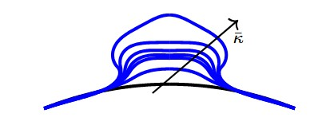
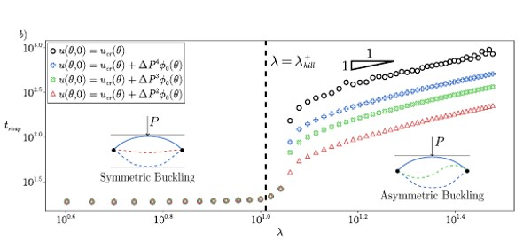
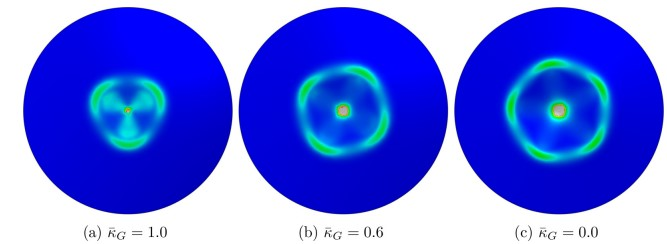
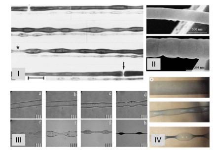
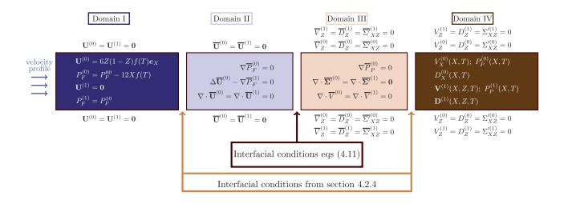

  

  <h2>Research</h2>
  

  

   
    

      <h3>ACTIVE SOLIDS</h3>
      <h3>An active material is broadly defined as a material that dynamically respond to external stimuli: examples include biological material, like membranes and tissues, and artificially engineered structures, like connected robots. <i> What is the emerging, global behaviouru, induced by the local rules that control the activity?</i> In this project we focus on active solids where the activity is embedded via either a non-mechanical stimulus that causes an incompatible bulk effect or <i> odd </i> elastic constitutive relationship. We aim to derive effective slender models from the three dimensional description and to study the emergent morphing induced by the activity in these systems. In a recent preprint we derived a fully non-linear model of stimuli responsive naturally curved shell to be used in the description of budding and vesiculation of solid membrane; we are currently study odd elastic plates and and limb fromation in growing domains.  </h3>
    

  

  

    
    

      <h3>MORPHING IN SLENDER STRUCTURES</h3>
      
<i>What determines how and when a slender structure changes shape, forms patterns, or jumps to a new stable state?</i> Bending, buckling, wrinkling and snapping in slender structure are due to the non-trivial interaction between geometry and constitutive properties and unvealing those hidden rules will provide principles that guide the design of responsive, bio-inspired, and functional materials capable of harnessing instabilities and patterns for novel mechanical functionality. In a recent work, responds to open questions on the non-linear coupling between imperfection and oscillations in the dynamical evolution induced by bifurcations in indented arches, potentially to be generalized to any system sharing the same bifurcation landscape. 

    

  

  

    

    
    

      <h3>LOCALIZATION</h3>
      
---

    

  

  

  

    
    

      <h3>INSTABILITY IN ELASTICITY</h3>
      
Many interesting shapes appearing in the biological world or in artificial devices emerge from mechanical instability. Compressive strains are the most common cause of instabilities, as in residually stressed or indendented pressurized shells. Beads-on-string patterns experimentally observed in solid cylinders for a wide range of material properties and structural lengths, instead, seems to emerge under a state of tension: we have first explored this problem via the competition between bulk elasticity and surface tension, i.e. elastocapillarity; more recently, we accounted for the bending resistance of the surface by introducing a bending modulus and an incompatible mean curvature. This leads to a novel elastobendo mode of beading that gives rise to finite-wavelength patterns with spatially localized modulations in amplitude that have not been seen in this system before and we show how elastobendo beading can provide a new interpretation of the infinite-wavelength instability seen in the elastocapillary version of this problem.

    

  

  

    
    

      <h3>Poroelasticity</h3>
      
---

    

  

<!--  

  <h2>Fun</h2>
  

  

    
    

      <h3>Person</h3>
      
Description.

    

  
 -->
  
